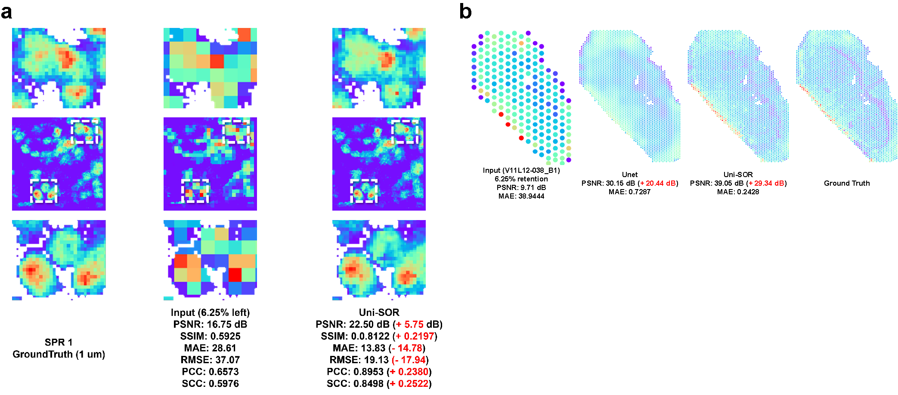
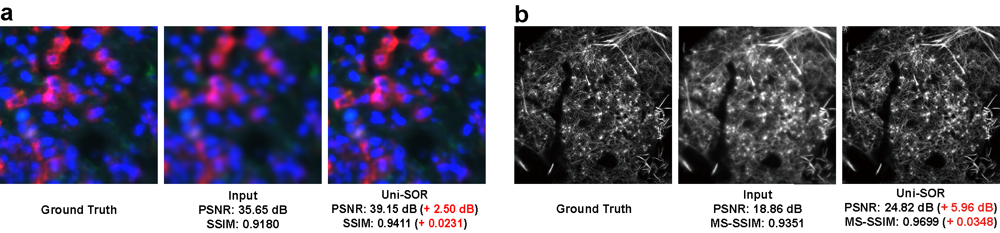

<div align="center">

# Uni-SOR

## A unified framework for high-fidelity recovery in spatially-resolved multi-omics and microscopy

<br>

<br>
<br>
<br>
<br>
<br>

### Supported platforms and modalities
<table>
  <tr bgcolor="#f2f2f2" align="center">
    <th align="center"><big>Systems</big></th>
    <th align="center"><big>Full name</big></th>
    <th align="center"><big>Standard abbreviation</big></th>
  </tr>
  <tr align="center">
    <td align="center"><small>Mass spectrometry imaging (MSI)</small></td>
    <td align="center"><small>Time-of-Flight Secondary Ion Mass Spectrometry</small></td>
    <td align="center"><small>ToF-SIMS (200 nm, 1 μm)</small></td>
  </tr>
  <tr align="center">
    <td align="center"><small>Mass spectrometry imaging (MSI)</small></td>
    <td align="center"><small>Desorption Electrospray Ionization Mass Spectrometry</small></td>
    <td align="center"><small>DESI-MS (50 μm)</small></td>
  </tr>
  <tr align="center">
    <td align="center"><small>Mass spectrometry imaging (MSI)</small></td>
    <td align="center"><small>Matrix-Assisted Laser Desorption/Ionization Mass Spectrometry</small></td>
    <td align="center"><small>MALDI-MS (50 μm)</small></td>
  </tr>
  <tr align="center">
    <td align="center"><small>Labeled mass spectrometry imaging (MSI)</small></td>
    <td align="center"><small>Imaging Mass Cytometry</small></td>
    <td align="center"><small>IMC (1 μm)</small></td>
  </tr>
  <tr align="center">
    <td align="center"><small>Spatially-resolved transcriptomics (SRT)</small></td>
    <td align="center"><small>10x Genomics Visium spatially-resolved transcriptomics</small></td>
    <td align="center"><small>SRT (25 μm, 100 μm)</small></td>
  </tr>
  <tr align="center">
    <td align="center"><small>Spatially-resolved proteomics (SRP)</small></td>
    <td align="center"><small>PhenoCycler-Fusion 2.0 spatially-resolved proteomics</small></td>
    <td align="center"><small>SRP (1 μm)</small></td>
  </tr>
  <tr align="center">
    <td align="center"><small>Histological imaging</small></td>
    <td align="center"><small>Hematoxylin and Eosin staining</small></td>
    <td align="center"><small>H&amp;E (20×, 40×)</small></td>
  </tr>
  <tr align="center">
    <td align="center"><small>Immunofluorescence imaging</small></td>
    <td align="center"><small>Multiplex Immunofluorescence</small></td>
    <td align="center"><small>mIF</small></td>
  </tr>
  <tr align="center">
    <td align="center"><small>Structured Illumination microscopy</small></td>
    <td align="center"><small>Structured Illumination Microscopy</small></td>
    <td align="center"><small>SIM</small></td>
  </tr>
  <tr align="center">
    <td align="center"><small>Immunohistochemical imaging</small></td>
    <td align="center"><small>Immunohistochemistry</small></td>
    <td align="center"><small>IHC</small></td>
  </tr>
</table>

</div>

## Overview
Degradation of high-fidelity spatial information in biomedical imaging compromises analytical reliability. Despite advancements in data reconstruction for MSI, a unified framework spanning microscopy and spatially-resolved multi-omics with robust generalizability and biologically faithful reconstruction, has not been established yet. Here, we present **Uni-SOR**, a unified framework built on a prior-constrained coarse-to-refinement principle. Uni-SOR estimates coarse images derived from high-fidelity information degradation and refines residual discrepancies under task-specific consistency constraints, respectively. We validate Uni-SOR’s generalizability across multiple microscopy and spatially-resolved multi-omics systems with significant improvements across diverse restoration metrics. Remarkably, even with **93.75%** high-frequency information loss, Uni-SOR still enables efficiently restoration and preserves concordance with over **90%** area under the curve in cross-scale analysis. Together, we demonstrate that Uni-SOR consistently outperforms the existing methods in defocused imaging, super-resolution and sparse sampling reconstruction of microscopy and spatially-resolved multi-omics with heterogeneous profiles, and enables high-fidelity high-frequency information recovery to facilitate biological exploration.

  



---

## Downstream-ready recovery
Uni-SOR is designed not only for visual restoration, but also for downstream biological and computational analysis. The recovered outputs can support multiple downstream tasks.
- **Cell segmentation with pathology foundation models**  
  Recovered images can be used as inputs for case-level or pathology foundation models to improve cell segmentation in degraded tissue images.
- **IHC prediction from recovered H&E**  
  Recovered H&E images can provide enhanced morphological information for IHC prediction and virtual staining tasks.
- **Joint analysis across MSI, SRT and H&E**  
  Recovered MSI, SRT and H&E data can be integrated for multi-modal spatial analysis, enabling more reliable alignment between molecular signals and tissue morphology.


---

## Repository status
This repository currently provides lightweight demo files for **SRP** and **SIM** tasks. 
For lightweight tasks, we provide free online access through our [homepage](https://www.lifemetabolomics.cn/unisor).

---

## Quick start

After downloading the repository, run one of the demo scripts according to the task.


### Sparse-sampling recovery

```bash
python "code/run sparse-sapmling demo.py"
```


### Super-resolution recovery

```bash
python "code/run super-resolution demo.py"
```


### SIM restoration
```bash
python "code/run SIM demo.py"
```
Before running a demo, modify the file paths and pretrained weight paths in the corresponding script.
```python
INPUT_TIFF_PATH = "path/to/your/input"
MODEL_WEIGHTS = "path/to/pretrained/weights"
```

---

## Demo availability
Only **SRP** and **SIM** demo files are currently included in this repository.

---


## Citation

If Uni-SOR is useful for your research, please cite our work.

```bibtex
@article{unisor2026,
  title={Uni-SOR: unified framework for high-fidelity recovery in spatially-resolved multi-omics and microscop},
  author={Hao Xu, Yu Zheng, Xiaopin Lai, Tianci Gao, Zhongze Wang, Yiting Wu, Yucheng Dai, Fangmeng Fu, Guihua Wang, Song-Ling Wang, Mao Li, Tie Shen, Shu-Hai Lin},
  journal={  },
  year={2026}
}
```

---

## License

This project is released for academic research use. Please check the license file for details.

---

<div align="center">

**Uni-SOR**  
**Unified spatial omics and microscopy recovery for high-fidelity biological discovery**

</div>
